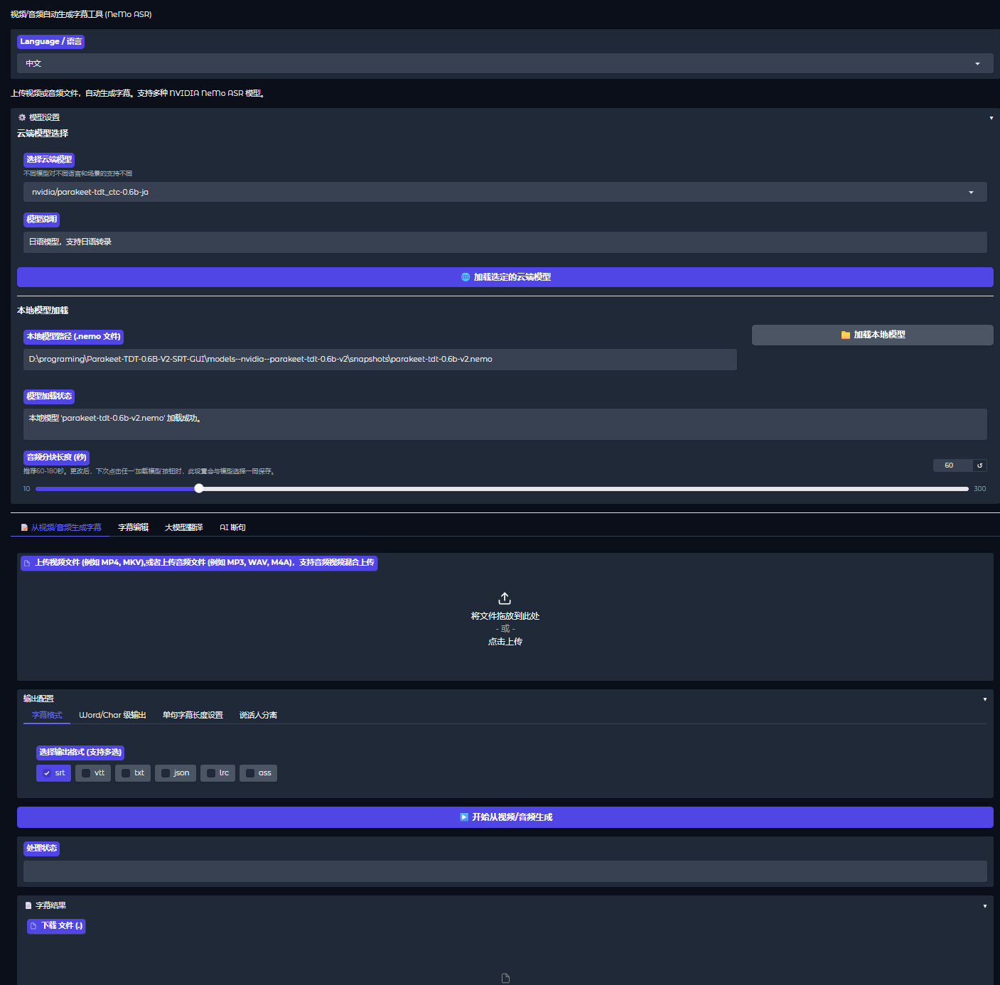

# Parakeet-TDT-GUI: 지능형 음성 전사 및 자막 워크스테이션

<p align="center">
  
  
  
</p>

<p align="center">
  <a href="./README_en.md">English</a>
  <a href="./README.md">简体中文</a> 
  <a href="./README_ja.md">日本語</a>
</p>

**Parakeet-TDT-GUI**는 강력한 로컬 시청각 처리 워크스테이션입니다. **NVIDIA NeMo** 프레임워크와 **Parakeet-TDT** 시리즈 모델을 기반으로 하여, 초고속 고정밀 음성 인식(ASR)을 제공할 뿐만 아니라 **LLM(대규모 언어 모델) 번역**, **지능형 문장 분리**, 그리고 **시각화된 자막 교정 에디터**를 통합했습니다.

이 프로젝트는 자막 제작자, 영상 크리에이터, 언어 학습자에게 "전사-교정-번역-내보내기"의 원스톱 솔루션을 제공하는 것을 목표로 합니다.

## ✨ 핵심 기능

### 1. 최고의 전사 (ASR)
*   **멀티 모델 지원**: NVIDIA 최신 Parakeet TDT 시리즈 모델 통합:
    *   `0.6b-v2`: 영어 인식 종합 능력이 가장 강력합니다.
    *   `0.6b-v3`: **20개 이상의 언어**(영어/독일어/프랑스어/러시아어/일본어/스페인어 등)를 지원합니다.
    *   `ctc-110m`: 초경량 모델로, 낮은 VRAM 소모와 매우 빠른 추론 속도를 자랑합니다.
    *   `0.6b-ja`: **일본어**에 최적화된 전용 모델입니다.
*   **다양한 형식 내보내기**: `SRT`, `VTT`, `ASS` (특수효과 자막), `LRC` (가사), `TXT`, `JSON` 내보내기를 지원합니다.
*   **마이크로초 급 정밀도**: **단어 단위(Word-level)** 및 **글자 단위(Character-level)** 타임스탬프 출력을 지원하여 노래방 자막 제작이나 정밀한 싱크 조절에 적합합니다.
*   **스마트 레이아웃**: 지능형 분할 로직이 내장되어 있어 한 줄의 최대 문자 수를 제한하여 자막이 너무 길어지는 것을 방지합니다.

### 2. LLM 지능형 번역
*   **멀티 모델 호환**: OpenAI 형식 인터페이스(**DeepSeek**, **ChatGPT**, **Claude** 등) 및 Google Gemini 기본 인터페이스와 호환됩니다.
*   **이중 언어 자막**: "원문+번역문"의 이중 언어 대조 자막 생성을 지원합니다.
*   **밀림 방지 알고리즘**: ID-Mapping 매핑 기술을 채택하여 대규모 모델 번역 시 발생하는 줄 수 불일치 및 타임라인 밀림 문제를 완벽하게 해결했습니다.
*   **높은 동시성**: 멀티 스레드 병렬 번역을 지원하여 긴 영상의 처리 속도를 대폭 향상시켰습니다.

### 3. 시각적 자막 에디터
*   **교정 테이블**: Excel과 유사한 인터페이스로 웹페이지에서 타임라인과 텍스트를 직접 수정할 수 있습니다.
*   **일괄 수정**: "오류-정답" 대조표를 정의(예: "Parakeet"를 "앵무새"로 통일)하여 전체 텍스트를 원클릭으로 일괄 변경할 수 있습니다.
*   **교정 메모리**: 교정 규칙을 자동으로 저장하여 사용할수록 더욱 편리해집니다.

### 4. AI 지능형 문장 분리 (Segmentation)
*   ASR이 생성한 줄바꿈 없는 긴 텍스트에 대해, LLM의 의미 이해 능력을 활용하여 지능적으로 문장을 나누고 원본 타임라인에 자동 매칭하여 인간의 읽기 습관에 맞는 짧은 문장 자막을 생성합니다.

---

## 시스템 요구 사항

*   **운영 체제**: Windows / Linux
*   **Python**: 3.10 - 3.12
*   **그래픽 카드**: **4GB 이상의 VRAM**을 탑재한 NVIDIA 그래픽 카드 권장 (CUDA 지원 필수).
    *   *참고: 그래픽 카드가 없어도 CPU 모드로 사용 가능하지만 속도가 느립니다.*
*   **FFmpeg**: **반드시 설치**하고 시스템 환경 변수에 구성해야 합니다 (오디오 추출에 사용).
### 설치 전제 조건: Windows 환경에서 의존성 설치 실패 시, 컴퓨터에 **Visual Studio**가 설치되어 컴파일이 가능한지 확인하십시오.

---

## 🚀 설치 가이드 (Windows)

### 방법 1: 배치 스크립트 사용 (초보자 추천)

1.  이 프로젝트를 로컬에 **복제/다운로드**합니다.
2.  **`install_dependencies.bat`**를 더블 클릭하여 실행합니다.
    *   스크립트가 자동으로 Python 가상 환경을 생성합니다.
    *   필요한 의존성 라이브러리를 자동으로 설치합니다.
3.  설치가 완료되면 **`launcher.bat`**를 더블 클릭하여 프로그램을 시작합니다.

> **주의**: GPU 가속이 필요한 경우, "방법 2"를 참고하여 수동으로 PyTorch를 설치하여 CUDA 버전을 일치시키는 것을 권장합니다.

### 방법 2: 수동 명령줄 설치 (권장)

1.  **저장소 복제:**
    ```bash
    git clone https://github.com/NINIYOYYO/NeMo-ASR-GUI.git
    cd NeMo-ASR-GUI.git
    ```

2.  **가상 환경 생성 및 활성화:**
    ```bash
    python -m venv .venv
    # Windows:
    .\.venv\Scripts\activate
    # Linux/Mac:
    source .venv/bin/activate
    ```

3.  **PyTorch 설치 (중요: GPU 사용자 필독!):**
    NVIDIA GPU를 사용하여 가속 처리를 원하신다면(강력 추천), **다른 의존성 항목을 설치하기 전에 반드시 사용 중인 CUDA 환경과 호환되는 PyTorch 버전을 수동으로 먼저 설치하십시오.**
    *   `Win+R` 키를 눌러 실행 창을 열고 `CMD`를 입력하여 터미널에 진입한 후 다음을 입력합니다:
    ```bash
    nvidia-smi
    ```
    엔터를 눌러 CUDA Version을 확인하십시오.
    *   [PyTorch 공식 설치 가이드 페이지](https://pytorch.org/get-started/locally/)를 방문합니다.
    *   운영 체제, 패키지 관리자(`pip` 권장), 컴퓨팅 플랫폼(예: CUDA 11.8, CUDA 12.1) 및 Python 버전에 맞는 올바른 설치 명령어를 선택합니다.
    *   예를 들어, `pip`를 사용하고 시스템에 CUDA 12.1 환경이 있는 경우:
        ```bash
        pip3 install torch torchvision torchaudio --index-url https://download.pytorch.org/whl/cu121
        ```
    이 단계를 건너뛰거나 NVIDIA GPU가 없는 경우, 이후 `nemo_toolkit` 설치 시 CPU 전용 PyTorch 버전이 기본으로 설치될 수 있습니다.

4.  **프로젝트 기타 의존성 설치:**
    ```bash
    pip install -r requirements.txt
    ```

5.  **FFmpeg 설치:**
    *   **Windows**: FFmpeg 프리컴파일 패키지를 다운로드하여 압축을 풀고 `bin` 폴더 경로를 시스템 `Path` 환경 변수에 추가합니다.
    *   터미널을 열고 `ffmpeg -version`을 입력하여 출력 내용이 보이면 설치 성공입니다.

6.  **프로그램 시작:**
    ```bash
    python main.py
    ```
---    
## 📖 사용 튜토리얼

### 1. 모델 로드 (Model Loading)
**"Model Settings" (모델 설정)** 영역으로 이동:
*   **클라우드 모델**: 모델(예: `nvidia/parakeet-tdt-0.6b-v2`)을 선택하고 'Load'를 클릭합니다. 처음에는 자동으로 다운로드됩니다(약 1-2GB).
*   **로컬 모델**: `.nemo` 파일의 절대 경로를 입력하고 'Load'를 클릭합니다.

### 2. 자막 생성 (Transcription)
1.  비디오/오디오 파일을 업로드합니다(일괄 처리 지원).
2.  **청크 길이 (Chunk Length)**: 60-180초를 권장합니다.
3.  **출력 형식**: 필요한 형식을 체크합니다(`srt` 및 `ass` 권장).
4.  **고급 옵션**:
    *   *Word/Char Level*: 노래방 효과가 필요할 때 체크합니다.
    *   *Smart Split (스마트 분할)*: 활성화하고 "최대 줄 너비"(예: 40자)를 설정하면 긴 문장을 자동으로 두 줄로 나눕니다.
5.  **"Start Generation"**을 클릭합니다.

### 3. 자막 편집 (Editing)
1.  **"Subtitle Edit"** 탭에서 방금 생성된 SRT 파일을 업로드합니다.
2.  **일괄 교정**: 왼쪽의 "교정표"에 자주 틀리는 단어와 올바른 단어를 입력하고 "Batch Replace"를 클릭합니다.
3.  **수동 미세 조정**: 아래 표에서 텍스트나 시간을 직접 수정합니다.
4.  **"Save Subtitle File"**을 클릭하여 수정된 파일을 내보냅니다.

### 4. AI 번역 (Translation)
1.  **"AI Translation"** 탭으로 전환합니다.
2.  LLM 구성을 입력합니다:
    *   **API Key**: 사용자의 OpenAI/DeepSeek/Gemini 키.
    *   **Base URL**: 예: `https://api.deepseek.com` 또는 `https://generativelanguage.googleapis.com/v1beta`.
    *   **Model**: 예: `deepseek-chat` 또는 `gemini-3.0-flash`.
3.  **대상 언어**와 **이중 언어** 여부를 설정합니다.
4.  시작을 클릭하면 시스템이 자동으로 병렬 번역을 수행하고 새 파일을 생성합니다.

### 5. AI 문장 분리 (Segmentation)
*   ASR로 생성된 자막이 글자는 맞지만 타임라인상에서 "한 문장이 너무 긴" 경우에 적합합니다.
*   자막을 업로드하고 LLM을 구성한 후 시작을 클릭하면, AI가 의미에 따라 타임라인을 재분할합니다.

---
## 🖥️ 인터페이스



## 📂 프로젝트 구조

```text
D:\PROGRAMING\PARAKEET-TDT-0.6B-V2-SRT-GUI
│  application.py           # 애플리케이션 핵심 오케스트레이션
│  app_ui.py                # Gradio UI 레이아웃 및 상호 작용
│  main.py                  # 시작 진입점
│  config.json              # 사용자 구성 파일
│  
├─controllers/              # 비즈니스 로직 컨트롤러
│      model_controller.py
│      subtitle_editor_controller.py
│      transcription_controller.py
│      translation_controller.py
│      
├─core/                     # 핵심 서비스
│      asr_service.py       # NeMo 모델 추론 래퍼
│      audio_processor.py   # FFmpeg 오디오 처리
│      post_processors.py   # 후처리 전략 (일본어 최적화/문장 분리)
│      subtitle_generator.py# 자막 형식 생성 (SRT/ASS/VTT 등)
│      translation_service.py # LLM 번역 및 문장 분리 서비스
│      
├─interfaces/               # 인터페이스 정의
├─locales/                  # 다국어 인터페이스 번역
├─subtitles/                # 출력 디렉터리
│  ├─edited/                # 편집된 자막
│  └─translated/            # 번역된 자막
│      
└─utils/                    # 유틸리티 (로그, 구성, 예외)
```

## ⚠️ 자주 묻는 질문 (FAQ)

**Q: 생성된 자막이 깨져 나오거나 타임라인이 겹치는 이유는 무엇인가요?**
A: 일치하지 않는 언어 모델을 사용했는지 확인하십시오. 예를 들어, 영어 모델로 중국어 오디오를 전사하면 예측할 수 없는 결과가 나옵니다. `0.6b-v3`(다국어) 또는 전용 모델을 사용하십시오.

**Q: 번역 기능에서 "429 Too Many Requests" 오류가 발생합니다.**
A: API 호출 빈도 제한입니다. 인터페이스에서 **"Concurrency (동시성)"** 슬라이더를 낮추거나 **"Chunk Size"**를 늘리십시오.

**Q: 프로그램이 FFmpeg를 찾을 수 없다고 합니다.**
A: CMD에서 `ffmpeg`를 입력했을 때 버전 정보가 표시되는지 확인하십시오. 방금 설치했다면 컴퓨터나 IDE를 재부팅하십시오.

**Q: 비디오 메모리 부족(OOM)이 발생하면 어떻게 하나요?**
A: 1. "오디오 청크 길이"를 줄이십시오(예: 30초로 설정). 2. 더 작은 모델(`ctc-110m`)을 사용하십시오.

---

## 🤝 기여 및 라이선스

이 프로젝트는 MIT 라이선스에 따라 오픈 소스로 제공됩니다. 핵심 모델의 저작권은 NVIDIA에 있습니다.
버그 제보나 새로운 기능 추가를 위한 Pull Request를 환영합니다!
